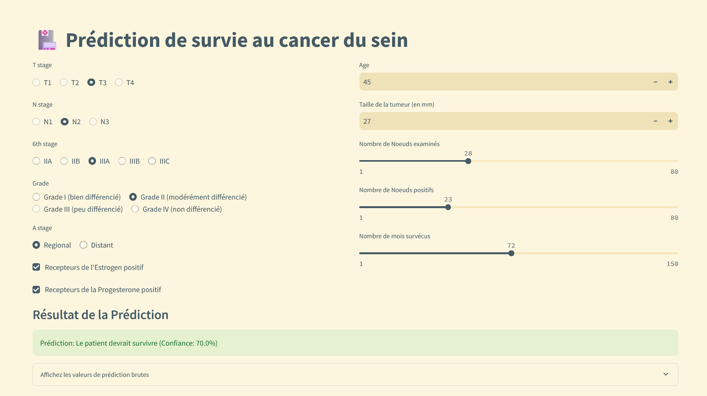

# Projet Machine Learning - Classification du Cancer du Sein



Ce projet a été réalisé dans le cadre de mon cursus en **B3 DEVIA DS** à l'**EPSI de Nantes**. L'objectif est de construire des modèles de machine learning permettant de classifier des données relatives au cancer du sein issues de la base **SEER Breast Cancer Data**.

## 🧪 Objectif du projet

Développer, entraîner et comparer plusieurs modèles de classification pour déterminer les performances sur les données fournies. Une application Streamlit a également été développée pour permettre de tester le modèle de classification le plus performant.

## 📂 Arborescence du projet

```
data/
    breast_cancer.csv         # Données d'entraînement et de test
models/
    model_rdf.joblib          # Modèle Random Forest sauvegardé
venv/                         # Environnement virtuel Python
.gitignore                    # Fichiers et dossiers à ignorer par Git
app.py                        # Application Streamlit
bc.ipynb                      # Notebook contenant les analyses et les entraînements
README.md                     # Ce fichier
requirements.txt              # Dépendances du streamlit
SEER Breast Cancer Data.png
```

## 📊 Modèles Utilisés

Les modèles suivants ont été implémentés et comparés à l'aide de la librairie **scikit-learn** :

1. **Random Forest**
2. **AdaBoost**
3. **Nearest Neighbors**
4. **Linear Discriminant Analysis (LDA)**
5. **Support Vector Classifier (SVC)**
6. **LightGBM**

Le modèle **Random Forest** a été retenu comme le plus performant pour ce projet.

## 🌐 Application Streamlit

Une application interactive développée avec **Streamlit** permet de tester le modèle **Random Forest** sur des nouvelles données. L'application est disponible dans le fichier `app.py`.

Pour exécuter l'application :
```bash
streamlit run app.py
```

## 🛠️ Dépendances du Notebook

Le fichier `bc.ipynb` utilise plusieurs bibliothèques Python pour la manipulation des données, la visualisation et la modélisation machine learning. Voici un aperçu des bibliothèques nécessaires :

### 📦 Bibliothèques standard
- `random` : Génération de nombres aléatoires
- `collections` : Utilisé pour les `OrderedDict`
- `time` : Gestion du temps pour mesurer les performances

### 🧮 Manipulation des données
- `pandas` : Manipulation et analyse de données tabulaires
- `numpy` : Calculs numériques et gestion des matrices
- `plotly` et `plotly.express` : Visualisation de données interactive
- `scipy.stats` : Calcul de statistiques, comme les tests de contingence (`chi2_contingency`)

### 🤖 Machine Learning (ML)
- `lightgbm` : Implémentation de LightGBM pour le modèle LGBMClassifier
- `scikit-learn` :
  - Prétraitement des données (`StandardScaler`)
  - Division des données (`train_test_split`)
  - Évaluation des performances (`accuracy_score`, `f1_score`, etc.)
- `shap` : Explication des prédictions des modèles via les valeurs de Shapley

### 🔧 Installation

Il y a en haut du notebook une cellule avec les commmandes pip. Il faut de-commenter la cellule et l'exécuter.

## 📦 Dépendances Streamlit

Les dépendances de l'application streamlit sont listées dans le fichier `requirements.txt`. Pour les installer, utilisez la commande suivante :
```bash
pip install -r requirements.txt
```

## 📈 Résultats

Les performances des modèles ont été évaluées selon les métriques classiques de classification (accuracy, precision, recall, F1-score). Retrouvez les détails de l'analyse dans le notebook `bc.ipynb`.


Voici une section sur le déploiement à ajouter dans votre README.md :

---

## 🌐 Déploiement de l'Application Streamlit

L'application Streamlit a été déployée en ligne pour permettre de tester le modèle **Random Forest** directement depuis un navigateur. Vous pouvez accéder à l'application via le lien suivant :

👉 [**breast-cancer-lia.streamlit.app**](https://breast-cancer-lia.streamlit.app/)
