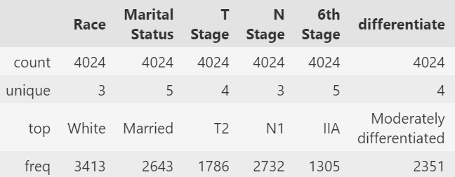
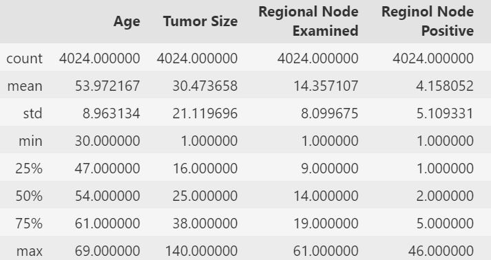
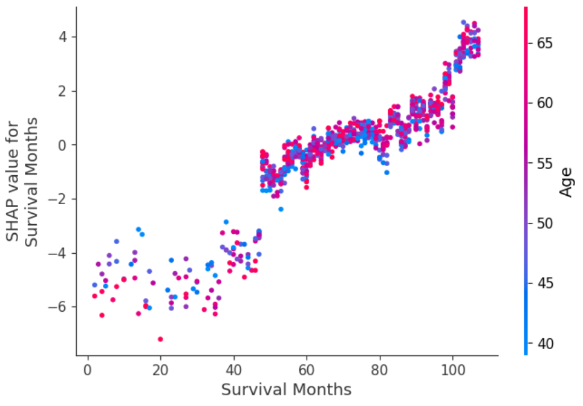
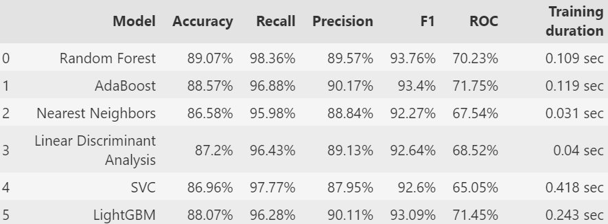

<!-- Style pour pouvoir avoir plusieurs col -->
<style>
.container{
    display: flex;
    gap: 50px;
}
.col{
    flex: 1;
}

* {
    border-radius: 10px;
}
</style>

# Projet Machine Learning
## Classification du Cancer du Sein

- Réalisé dans le cadre du cours **Frame IA** de 3ème année
- École : **EPSI de Nantes**
- Objectif : Classification des données issues de **SEER Breast Cancer Data**

---

## 🧪 Objectif du Projet

* **Développer, entraîner et comparer** plusieurs modèles de machine learning.
* Identifier le modèle offrant les meilleures performances.
* Développer une application **Streamlit** interactive pour tester les prédictions.

---

## 📂 Arborescence du Projet

Repo 👉 [BahAilime/breast-cancer-ml](https://github.com/BahAilime/breast-cancer-ml)

```
data/
    breast_cancer.csv         # Données d'entraînement et de test
models/
    model_rdf.joblib          # Modèle Random Forest sauvegardé
venv/                         # Environnement virtuel Python
.gitignore                    # Fichiers et dossiers à ignorer par Git
app.py                        # Application Streamlit
bc.ipynb                      # Notebook contenant les analyses et entraînements
README.md                     # Ce fichier
requirements.txt              # Dépendances du streamlit
SEER Breast Cancer Data.png
```

---

## 📊 Modèles Utilisés

- **Random Forest**  
- **AdaBoost**  
- **Nearest Neighbors**  
- **Linear Discriminant Analysis (LDA)**  
- **Support Vector Classifier (SVC)**  
- **LightGBM**  

👉 **Random Forest** : Modèle le plus performant.

---


<!-- ## Développement - Importation des Bibliothèques

- Importation des bibliothèques nécessaires pour :
  - Prétraitement des données
  - Visualisation
  - Modélisation

```python
AAAAAAA
```

--- -->

## Nettoyage des Données

- Vérification des valeurs manquantes et des doublons

```py

df_bc.describe(include=object)

df_bc.describe()

```




---

## Nettoyage des Données

- Traitement des variables catégorielles

```python

df_bc["Grade"] = df_bc["Grade"].replace({" anaplastic; Grade IV": 4})

df_bc["N Stage"] = df_bc["N Stage"].replace({"N1": 1, "N2": 2, "N3": 3})

df_bc = pd.get_dummies(df_bc, columns=["Marital Status"], dtype=int)

```

---

## Modélisation : Random Forest

```python

rdf_params = {
    "random_state": SEED,
    "max_leaf_nodes": 330,
    "max_depth": 5,
    "n_estimators": 60,
    "criterion": "gini",
    "max_features": "sqrt",
    "min_impurity_decrease": 0.00001
}

model_rdf = RandomForestClassifier(**rdf_params)
model_rdf.fit(X_train, y_train)

```

---

## Évaluation des models

```py
def add_results(df, model_name, y_test, y_pred, duration):
    accuracy = accuracy_score(y_test, y_pred)
    recall = recall_score(y_test, y_pred)
    precision = precision_score(y_test, y_pred)
    f1 = f1_score(y_test, y_pred)
    roc = roc_auc_score(y_test, y_pred)
    df.loc[len(df)] = [model_name, rnd_prcnt(accuracy), ... , rnd_sec(duration)]
```

---

## Développement - Modélisation : Autres Modèles

- **AdaBoost** : Amélioration par boosting adaptatif
- **Nearest Neighbors** : Classification par proximité
- **LDA** : Analyse discriminante linéaire
- **SVC** : Classification par vecteurs de support
- **LightGBM** : Gradient Boosting pour grands ensembles de données

---

## Développement - Interprétation des Modèles

- Importance des caractéristiques avec SHAP

```python
shap.dependence_plot(
    "Survival Months",
    shap_values,
    X_test, 
    interaction_index="Age"
    )
```



---

## 📈 Résultats



---

## 🌐 Application Streamlit

- Application interactive pour tester le modèle **Random Forest**.
- Disponible dans le fichier `app.py`.

### Exécution :
```bash
streamlit run app.py
```

---

## 🌐 Déploiement de l'Application Streamlit

- Lien vers l'application déployée :

👉 [**breast-cancer-lia.streamlit.app**](https://breast-cancer-lia.streamlit.app/)
